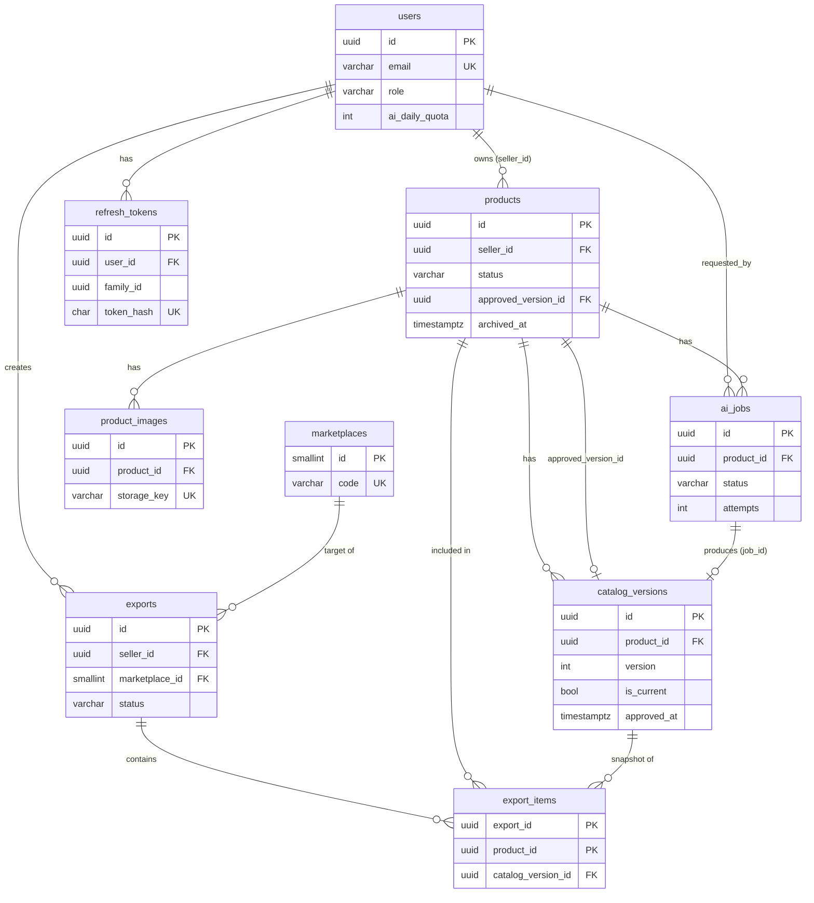

# CatalogAI — Phase 1 Spec, Part 1: Architecture & Data Model

Covers spec items 1–7. Parts 2 and 3 cover API/schemas and the systems/security/ops design.

---

## 0. Decision log — where this spec departs from the original proposal

Each row is a deliberate change. Every one is something you must be able to defend in an interview.

| ID | Change | Why (problem solved) | Alternative | Why this choice |
|----|--------|----------------------|-------------|-----------------|
| D1 | **UUID primary keys** (not auto-increment ints) | Sequential IDs make IDOR probing trivial (`/products/1`, `/products/2`) and leak business volume. | BIGINT identity; ULID/UUIDv7 | UUIDv4 via `gen_random_uuid()` is zero-dependency. UUIDv7 has better index locality, but at this scale the difference is irrelevant. Security is defense-in-depth; ownership checks remain the real control. |
| D2 | `catalog_data` → **`catalog_versions`**, with an immutable `ai_output` column and separate editable working columns | Your "overwrite vs history" requirement. Lets us show "what the AI said vs. what the seller changed", and keeps exported/approved data immutable. | Store diffs/event log; separate `ai_versions` and `seller_edits` tables | One table, one row per version, is the simplest thing that gives full history. Copy-on-write rule for approved versions (§3.7). |
| D3 | Add **`refresh_tokens`** table | Refresh tokens must be revocable and support rotation + reuse detection. Stateless JWT refresh tokens can't do this. | Stateless long-lived JWT; Redis-only tokens | DB is durable and queryable (list sessions, revoke family). Redis loss must not log everyone out. |
| D4 | Add **`export_items`** | An export must record *exactly which version of which product* it contained. Otherwise "what did I send to the marketplace on Tuesday?" is unanswerable. | JSON array of ids on `exports` | Join table gives FK integrity and queryability. |
| D5 | **No separate `worker/` codebase**. Worker is the same Python package and image as the backend, run with a different command | The worker needs the same models, config, services, and AI abstraction. A separate folder means duplicated code or a shared-package headache. | Separate repo/package | One image, two entrypoints (`uvicorn` / `arq`). This is the standard pattern. |
| D6 | **`ai_jobs` table is the source of truth; Redis is only the delivery mechanism** | Redis can lose data, and "DB row created but enqueue failed" (dual-write) is the classic bug. Job state must survive Redis loss. | Celery with Redis as the only state; Postgres-as-queue (`SKIP LOCKED`) | DB row + enqueue-after-commit + a sweeper that re-enqueues orphaned jobs. See Part 3 §12. |
| D7 | **Two-stage AI pipeline** (vision extraction with evidence → text generation constrained to extracted facts) + deterministic guardrails | The core requirement, "never invent facts", cannot be met by one prompt saying "don't hallucinate". It needs structural separation and code-level checks. | Single multimodal call | Two stages make fact-extraction auditable and let stage 2 use a cheaper text-only model. Part 3 §11. |
| D8 | **Images are uploaded through the backend**, not directly to S3 via presigned PUT | We must validate (magic bytes, pixel-bomb, re-encode, strip EXIF/GPS) *before* anything is stored. | Presigned direct upload + post-upload verification | Proxying costs some bandwidth, but at 10 MB per image and a single seller it is fine. It keeps validation in one trusted place. Reads use presigned GET URLs. |
| D9 | **Frontend polls** job status (2 s, backoff) | Simplest reliable option. | WebSocket/SSE | You already know WebSockets, so this is not about capability. Polling has no connection-state complexity, and jobs take 5–30 s. SSE over Redis pub/sub is an optional Phase-8 upgrade behind the same endpoint contract. |
| D10 | **Exports generated synchronously** in v1, capped at 500 products | 500 rows of CSV/XLSX takes milliseconds to a couple of seconds. A queue would be overengineering. | Async export job | `exports.status` exists so async can be added without an API change. |
| D11 | **Soft archive** via `products.archived_at`, not a status | Status is *workflow* state. Archived is orthogonal (an APPROVED product can be archived). | ARCHIVED status; hard delete | Keeps the state machine clean. Exports reference products, so hard delete would break history. |
| D12 | `exports.file_path` → `storage_key` | We store object keys, not filesystem paths. | — | Naming honesty. |
| D13 | **Marketplace rules live in code** (declarative Python specs), `marketplaces` table is a registry | Rules are versioned with the code and unit-tested. | Rules stored in DB/JSON editable at runtime | No admin UI for rule editing exists. DB-stored rules add a migration and UI burden for zero current benefit. |
| D14 | Add **MinIO** to local Docker | Develop against S3-compatible storage with no AWS account/cost. | LocalStack; real S3 dev bucket | MinIO is light and S3-API-compatible. Only `S3_ENDPOINT_URL` differs from prod. |
| D15 | **Per-user AI daily quota** (`users.ai_daily_quota`) | AI calls cost money. Without this, one abusive/buggy client burns the budget. | Only rate limiting | Rate limits stop bursts. Quotas cap total spend. Counted from `ai_jobs` (durable), not Redis. |
| D16 | **Same-origin deployment** (reverse proxy serves SPA at `/`, API at `/api`) | Cookie-based refresh tokens and CORS become trivial. | Separate domains + CORS + `SameSite=None` | Fewer moving parts and a smaller attack surface. Vite dev proxy mimics it. |

Enums are stored as `VARCHAR` + `CHECK` constraints, **not native Postgres ENUMs**: adding a value to a native enum needs awkward `ALTER TYPE` migrations (it can't run inside a transaction on older versions, and removal is unsupported).

---

## 1. Final architecture

```
                         ┌───────────────────────── Docker host (EC2) ─────────────────────────┐
 Browser ── HTTPS ──►    │  Caddy/nginx (TLS, static SPA, /api → backend, security headers)     │
                         │      │                                                               │
                         │      ├──► frontend static files (React build)                        │
                         │      └──► backend  (FastAPI, uvicorn)                                │
                         │              │        │            │                                │
                         │              │        │            └──► Redis  ◄── worker (ARQ)     │
                         │              │        │                  ▲            │    │        │
                         │              ▼        ▼                  │            │    ▼        │
                         │         PostgreSQL   S3 / MinIO ◄────────┼────────────┘  AI provider│
                         │       (source of truth) (images, exports)│   (HTTPS, external)      │
                         └──────────────────────────────────────────┴──────────────────────────┘
```

**Layering inside the backend** (dependencies point downward only):

```
api/v1/*.py      HTTP only: parse, auth dependency, call service, shape response. No business logic, no SQL.
   ↓
services/*.py    Business rules, state machine, transactions (services own commit/rollback).
   ↓
repositories/    All SQLAlchemy queries. Ownership scoping is built in (get_owned(id, seller_id)).
   ↓
db/models/       ORM models only.

providers/       AI + storage adapters behind Protocols (ai/base.py, storage/base.py). Services depend on the Protocol.
worker/          ARQ task functions. Thin: load job → call services/pipeline → persist. Same code, different entrypoint.
```

Why layered and not "logic in routes": the worker and the API must run the *same* business rules (e.g., "job completion moves product to REVIEW"). Rules in services are reusable from both. Repositories keep tenant-scoping in one place, so a forgotten `WHERE seller_id=` is structurally hard to write.
Why not full DDD or a generic `Repository[T]` base class: over-abstraction. Repositories are plain classes with named query methods.

### Final repository layout

```
catalogai/
  backend/
    app/
      main.py
      api/v1/{auth,users,products,images,ai,catalog,marketplace,exports,dashboard,admin}.py
      api/deps.py                 # get_db, get_current_user, require_role, rate_limit
      core/{config,security,exceptions,logging,rate_limit}.py
      db/{base,session}.py
      db/models/{user,refresh_token,product,product_image,ai_job,catalog_version,marketplace,export}.py
      schemas/                    # Pydantic, one file per resource
      repositories/
      services/
        auth_service.py product_service.py image_service.py catalog_service.py
        ai_service.py             # orchestrates jobs (enqueue, quota, status)
        marketplace/{engine.py, schemas/{generic,amazon_style,flipkart_style}.py}
        export_service.py
      ai/
        base.py                   # LLMProvider Protocol
        providers/{anthropic.py, gemini.py, fake.py}
        pipeline.py               # stage 1 → stage 2 → guardrails
        guardrails.py
        taxonomy.json             # curated category list
        prompts/v1/{extract.md, write.md, regenerate_section.md}
      storage/{base.py, s3.py}
      worker/{settings.py, tasks.py, sweeper.py}   # ARQ entrypoint
      utils/
    alembic/  tests/  evals/  pyproject.toml  Dockerfile
  frontend/   (as specified)
  docs/  docker/  .github/workflows/  docker-compose.yml  docker-compose.dev.yml  .env.example  README.md
```

`pyproject.toml` (with `uv` or `pip-tools`) instead of bare `requirements.txt`: pins direct dependencies plus tool config (ruff, mypy, pytest) in one file. Generate a lockfile for reproducible builds.

---

## 2. ER diagram



---

## 3. Tables, columns, keys, constraints, indexes

Conventions: all timestamps are `timestamptz` stored in UTC. `created_at default now()`. `updated_at default now()` and is set on ORM UPDATE. PKs are `uuid default gen_random_uuid()` unless noted. Extensions: `pg_trgm` (product search).
"ON DELETE" choices are deliberate: **tenant data uses RESTRICT from `users`** (we deactivate, we never hard-delete sellers), while **child rows of a product CASCADE** (images, jobs, versions die with it, but products are only soft-archived in normal operation).

### 3.1 `users`

| Column | Type | Null | Notes |
|---|---|---|---|
| id | uuid PK | no | |
| name | varchar(120) | no | |
| email | varchar(320) | no | Normalized (trimmed, lowercased) by the service. |
| password_hash | varchar(255) | no | Argon2id encoded string. |
| role | varchar(16) | no | default `'SELLER'`; CHECK in (`SELLER`,`ADMIN`) |
| is_active | boolean | no | default true |
| ai_daily_quota | integer | no | default 50; CHECK >= 0 |
| created_at, updated_at | timestamptz | no | |

Indexes/constraints: `UNIQUE INDEX ux_users_email_lower ON users (lower(email))` (defense in depth if a code path forgets to normalize).

### 3.2 `refresh_tokens`

| Column | Type | Null | Notes |
|---|---|---|---|
| id | uuid PK | no | |
| user_id | uuid FK→users.id ON DELETE CASCADE | no | |
| family_id | uuid | no | One login session = one family; rotation keeps the family. |
| token_hash | char(64) | no | SHA-256 hex of the opaque token. **UNIQUE.** Raw token is never stored. |
| expires_at | timestamptz | no | |
| revoked_at | timestamptz | yes | |
| replaced_by_id | uuid FK→refresh_tokens.id ON DELETE SET NULL | yes | Set on rotation. Reuse of a rotated token ⇒ revoke whole family. |
| user_agent | varchar(255) | yes | Informational. |
| created_at | timestamptz | no | |

Indexes: `(user_id)`, `(family_id)`, `(expires_at)` (cleanup job).

### 3.3 `products`

| Column | Type | Null | Notes |
|---|---|---|---|
| id | uuid PK | no | |
| seller_id | uuid FK→users.id ON DELETE RESTRICT | no | |
| name | varchar(200) | no | |
| sku | varchar(64) | yes | Seller's own SKU. |
| category | varchar(255) | yes | Seller-provided hint (free text). *Not* the AI-suggested category. |
| brand | varchar(120) | yes | Seller-provided. |
| seller_notes | text | yes | Free-form info for the AI; CHECK length ≤ 2000. |
| seller_attributes | jsonb | no | default `'{}'`. Facts the seller *explicitly supplies* (dimensions, material, weight…). Only source allowed for dimensions. CHECK `jsonb_typeof = 'object'`. |
| status | varchar(16) | no | default `'DRAFT'`; CHECK in (DRAFT, PROCESSING, REVIEW, APPROVED, REJECTED, EXPORTED) |
| review_note | text | yes | Reason given on reject. |
| approved_version_id | uuid FK→catalog_versions.id ON DELETE SET NULL | yes | Circular FK; declared with `use_alter=True` / added in a separate migration step. |
| archived_at | timestamptz | yes | Soft delete. |
| created_at, updated_at | timestamptz | no | |

Indexes:
- `(seller_id, status, updated_at DESC)`: the dashboard and list-by-status queries.
- `(seller_id, created_at DESC)`: default listing.
- `UNIQUE (seller_id, sku) WHERE sku IS NOT NULL AND archived_at IS NULL`: SKU uniqueness per seller, reusable after archive.
- `GIN (name gin_trgm_ops)`: fast `ILIKE '%term%'` search. A plain btree can't serve a leading wildcard. Search always also filters by `seller_id`, so the planner narrows first.

Why not full-text search / Elasticsearch: seller catalogs are thousands of rows, not millions. `pg_trgm` is enough. Say so rather than adding infrastructure.

### 3.4 `product_images`

| Column | Type | Null | Notes |
|---|---|---|---|
| id | uuid PK | no | |
| product_id | uuid FK→products.id ON DELETE CASCADE | no | |
| storage_key | varchar(512) | no | UNIQUE. Server-generated, e.g. `products/{seller_id}/{product_id}/{image_id}.jpg`. |
| original_filename | varchar(255) | no | Display only; sanitized; **never used in the key**. |
| mime_type | varchar(50) | no | CHECK in (`image/jpeg`,`image/png`,`image/webp`); value comes from server-side sniffing, not the client header. |
| file_size | integer | no | bytes of the *stored* object; CHECK between 1 and 10485760 |
| width, height | integer | no | |
| sha256 | char(64) | no | For duplicate detection within a product. |
| sort_order | integer | no | 0 = primary image. |
| created_at | timestamptz | no | |

Constraints/indexes: `UNIQUE (product_id, sha256)`; `UNIQUE (product_id, sort_order) DEFERRABLE INITIALLY DEFERRED` (so reordering can swap values inside one transaction); index on `product_id`. Max 8 images per product is enforced in the service, because a count limit is awkward as a DB constraint.

### 3.5 `ai_jobs`

| Column | Type | Null | Notes |
|---|---|---|---|
| id | uuid PK | no | Also used as the ARQ job id, so enqueue is idempotent. |
| product_id | uuid FK→products.id ON DELETE CASCADE | no | |
| requested_by | uuid FK→users.id ON DELETE RESTRICT | no | For quota counting. |
| job_type | varchar(24) | no | CHECK in (`GENERATE_CATALOG`,`REGENERATE_SECTION`) |
| params | jsonb | no | default `'{}'`. e.g. `{"section":"title","instructions":"shorter"}` |
| status | varchar(16) | no | CHECK in (QUEUED, PROCESSING, COMPLETED, FAILED) |
| attempts | smallint | no | default 0 |
| max_attempts | smallint | no | default 3 |
| error_code | varchar(48) | yes | Machine-readable, e.g. `PROVIDER_TIMEOUT`, `GUARDRAIL_FAILED`. |
| error_message | text | yes | Sanitized, user-safe. Full detail goes to logs. |
| provider | varchar(32) | yes | |
| model_name | varchar(80) | yes | |
| input_tokens, output_tokens | integer | yes | Cost tracking. |
| result_version_id | uuid FK→catalog_versions.id ON DELETE SET NULL | yes | |
| heartbeat_at | timestamptz | yes | Updated by the worker during processing; the sweeper uses it to find dead workers. |
| created_at | timestamptz | no | This is "queued at". |
| started_at, completed_at | timestamptz | yes | |

**Retry representation:** a transient failure sets the status back to `QUEUED` (with `attempts` incremented and `error_code` filled), so the UI can show "retrying (2/3)". `FAILED` is terminal.

Indexes/constraints:
- `UNIQUE (product_id) WHERE status IN ('QUEUED','PROCESSING')`: **at most one active job per product, enforced by the DB**, not by a racy `SELECT`-then-`INSERT`. Double-clicking Generate can't create two jobs.
- `(product_id, created_at DESC)`: latest job lookup.
- `(status, heartbeat_at)`: sweeper.
- `(requested_by, created_at)`: daily quota count.

### 3.6 `catalog_versions`

| Column | Type | Null | Notes |
|---|---|---|---|
| id | uuid PK | no | |
| product_id | uuid FK→products.id ON DELETE CASCADE | no | |
| version | integer | no | 1,2,3… per product. Allocated in the service inside a transaction that locks the product row (`SELECT … FOR UPDATE`). |
| source | varchar(16) | no | CHECK in (`AI_GENERATED`,`SELLER_EDIT`,`RESTORED`) |
| job_id | uuid FK→ai_jobs.id ON DELETE SET NULL | yes | **UNIQUE WHERE job_id IS NOT NULL**: a retried job cannot create two versions. |
| product_type | varchar(200) | yes | |
| category_id | varchar(64) | yes | ID from `taxonomy.json`; NULL if the AI wasn't confident. |
| category_path | varchar(255) | yes | e.g. `Electronics > Audio > Headphones`. |
| title | varchar(500) | yes | Working copy (editable). |
| description | text | yes | |
| bullet_points | jsonb | no | default `'[]'`; CHECK `jsonb_typeof='array'` |
| keywords | jsonb | no | default `'[]'`; CHECK array |
| attributes | jsonb | no | default `'{}'`. Map `name → {"value": …, "source": "IMAGE"|"SELLER"|"UNKNOWN", "confidence": "HIGH"|"MEDIUM"|"LOW"}`. Unknown ⇒ `value: null`. |
| warnings | jsonb | no | default `'[]'`. Non-blocking guardrail findings shown in review UI. |
| confidence_score | numeric(3,2) | yes | CHECK 0..1. A heuristic, not a calibrated probability (Part 3 §11). |
| ai_extraction | jsonb | yes | **Immutable.** Stage-1 output (facts + evidence). |
| ai_output | jsonb | yes | **Immutable.** Stage-2 validated output. Enables "reset to AI version" and diffing. NULL for RESTORED/edits that don't originate from AI. |
| model_name | varchar(80) | yes | |
| prompt_version | varchar(16) | yes | e.g. `v1`. |
| is_current | boolean | no | default false |
| approved_at | timestamptz | yes | Once set, the row's *working columns become immutable*. |
| created_at, updated_at | timestamptz | no | |

Constraints/indexes:
- `UNIQUE (product_id, version)`.
- `UNIQUE (product_id) WHERE is_current`: exactly ≤ 1 current version per product, DB-enforced. Switching current is one transaction (unset old, set new).
- `(product_id, version DESC)`.

**Copy-on-write rule (§3.7 of the design):** editing a version that has `approved_at IS NOT NULL` does *not* mutate it. The service creates a new version (`source=SELLER_EDIT`), copies fields, applies the edit, marks it current, and moves the product back to `REVIEW`. Editing an unapproved current version updates it in place (otherwise every keystroke-save spawns a version). Result: approved and exported data is provably immutable, and version history stays meaningful (AI generations + post-approval edits).

Field-name note: your spec used `generated_title`, `attributes_json`, `suggested_category`. I renamed these to `title`, `attributes`, `category_*` because the columns hold the editable working copy, not only the generated one. The AI's original is in `ai_output`.

### 3.7 `marketplaces`

| Column | Type | Notes |
|---|---|---|
| id | smallint identity PK | Seeded, small, stable. |
| code | varchar(32) UNIQUE | `GENERIC`, `AMAZON_STYLE`, `FLIPKART_STYLE` |
| name | varchar(80) | |
| schema_version | varchar(16) | Version of the in-code rule set, recorded on each export. |
| is_active | boolean | default true |
| created_at | timestamptz | |

Seeded by an Alembic data migration.

### 3.8 `exports`

| Column | Type | Null | Notes |
|---|---|---|---|
| id | uuid PK | no | |
| seller_id | uuid FK→users.id ON DELETE RESTRICT | no | |
| marketplace_id | smallint FK→marketplaces.id | no | |
| schema_version | varchar(16) | no | Copied from the marketplace at export time. |
| file_type | varchar(8) | no | CHECK in (`CSV`,`XLSX`) |
| storage_key | varchar(512) | yes | Null until the file is uploaded. |
| file_size | bigint | yes | |
| product_count | integer | no | CHECK ≥ 0 |
| status | varchar(16) | no | CHECK in (`PENDING`,`COMPLETED`,`FAILED`) |
| error_message | text | yes | |
| created_at | timestamptz | no | |
| completed_at | timestamptz | yes | |

Index: `(seller_id, created_at DESC)`.

### 3.9 `export_items`

PK `(export_id, product_id)`. `export_id` FK→exports ON DELETE CASCADE. `product_id` FK→products ON DELETE RESTRICT. `catalog_version_id` FK→catalog_versions ON DELETE RESTRICT (a snapshot must not vanish). Index on `product_id` (to answer "where was this product exported?").

### 3.10 Product status state machine (enforced in `ProductService`, tested exhaustively)

```
DRAFT ──generate (≥1 image, quota ok)──► PROCESSING ──job ok──► REVIEW
                                              │ job failed (terminal)
                                              └► back to REVIEW if a current version exists, else DRAFT
REVIEW ──approve──► APPROVED ──export──► EXPORTED
REVIEW ──reject(note)──► REJECTED ──edit──► REVIEW
REJECTED / REVIEW ──regenerate──► PROCESSING
APPROVED / EXPORTED ──edit (copy-on-write)──► REVIEW
APPROVED ──export──► EXPORTED     EXPORTED ──export again──► EXPORTED
```
Any other transition returns `409 INVALID_STATE_TRANSITION`. Approve requires the GENERIC schema to validate cleanly. Marketplace-specific validation happens at export.

---

## 4. SQLAlchemy model design (SQLAlchemy 2.0 typed style)

Key decisions, then representative code.

- **`DeclarativeBase` + `Mapped[]` / `mapped_column`** (2.0 style, type-checkable with mypy).
- **Constraint naming convention** on `MetaData`, without which Alembic can't reliably drop/alter constraints.
- **Async engine (`asyncpg`), `async_sessionmaker(expire_on_commit=False)`**. Expiring attributes after commit triggers implicit lazy IO, which is illegal in async.
- **`lazy="raise"` on all relationships**: any un-eagerly-loaded access fails loudly in dev/tests instead of silently issuing N+1 queries. Repositories choose `selectinload`/`joinedload` explicitly.
- **Unit of work in services**: repositories `flush`, services `commit`. One HTTP request = one session = one transaction. The worker does the same per job step.
- **Enums**: Python `StrEnum` mapped with `Enum(..., native_enum=False, create_constraint=True, length=16)`.
- JSONB columns are typed at the boundary by Pydantic (§8 of Part 2), not left as raw dicts in services.

```python
# db/base.py
from sqlalchemy import MetaData
from sqlalchemy.orm import DeclarativeBase

NAMING = {
    "ix": "ix_%(column_0_label)s",
    "uq": "uq_%(table_name)s_%(column_0_name)s",
    "ck": "ck_%(table_name)s_%(constraint_name)s",
    "fk": "fk_%(table_name)s_%(column_0_name)s_%(referred_table_name)s",
    "pk": "pk_%(table_name)s",
}

class Base(DeclarativeBase):
    metadata = MetaData(naming_convention=NAMING)

class TimestampMixin:
    created_at: Mapped[datetime] = mapped_column(server_default=func.now())
    updated_at: Mapped[datetime] = mapped_column(server_default=func.now(), onupdate=func.now())
```

```python
# db/session.py
engine = create_async_engine(settings.DATABASE_URL, pool_size=10, max_overflow=10, pool_pre_ping=True)
SessionLocal = async_sessionmaker(engine, expire_on_commit=False)

async def get_db() -> AsyncIterator[AsyncSession]:
    async with SessionLocal() as session:
        yield session          # services commit; on exception the context manager rolls back
```

```python
# db/models/product.py (abridged)
class ProductStatus(StrEnum):
    DRAFT = "DRAFT"; PROCESSING = "PROCESSING"; REVIEW = "REVIEW"
    APPROVED = "APPROVED"; REJECTED = "REJECTED"; EXPORTED = "EXPORTED"

class Product(Base, TimestampMixin):
    __tablename__ = "products"
    id: Mapped[uuid.UUID] = mapped_column(primary_key=True, server_default=text("gen_random_uuid()"))
    seller_id: Mapped[uuid.UUID] = mapped_column(ForeignKey("users.id", ondelete="RESTRICT"))
    name: Mapped[str] = mapped_column(String(200))
    sku: Mapped[str | None] = mapped_column(String(64))
    status: Mapped[ProductStatus] = mapped_column(
        Enum(ProductStatus, native_enum=False, length=16, create_constraint=True),
        default=ProductStatus.DRAFT, server_default="DRAFT")
    seller_attributes: Mapped[dict] = mapped_column(JSONB, server_default=text("'{}'::jsonb"))
    approved_version_id: Mapped[uuid.UUID | None] = mapped_column(
        ForeignKey("catalog_versions.id", ondelete="SET NULL", use_alter=True, name="fk_products_approved_version"))
    archived_at: Mapped[datetime | None]

    images: Mapped[list["ProductImage"]] = relationship(lazy="raise", order_by="ProductImage.sort_order",
                                                        cascade="all, delete-orphan", passive_deletes=True)
    versions: Mapped[list["CatalogVersion"]] = relationship(
        lazy="raise", foreign_keys="CatalogVersion.product_id", order_by="CatalogVersion.version.desc()")

    __table_args__ = (
        Index("ux_products_seller_sku", "seller_id", "sku", unique=True,
              postgresql_where=text("sku IS NOT NULL AND archived_at IS NULL")),
        Index("ix_products_seller_status_updated", "seller_id", "status", text("updated_at DESC")),
        Index("ix_products_name_trgm", "name", postgresql_using="gin", postgresql_ops={"name": "gin_trgm_ops"}),
    )
```

```python
# db/models/catalog_version.py (abridged) — partial unique indexes are the point
__table_args__ = (
    UniqueConstraint("product_id", "version"),
    Index("ux_catalog_current", "product_id", unique=True, postgresql_where=text("is_current")),
    Index("ux_catalog_job", "job_id", unique=True, postgresql_where=text("job_id IS NOT NULL")),
    CheckConstraint("jsonb_typeof(bullet_points) = 'array'", name="bullets_is_array"),
    CheckConstraint("confidence_score BETWEEN 0 AND 1", name="confidence_range"),
)
```

**Repositories** expose intent-revealing methods and always take the tenant:

```python
class ProductRepository:
    async def get_owned(self, product_id: UUID, seller_id: UUID, *, for_update=False) -> Product | None: ...
    async def list_owned(self, seller_id: UUID, *, q, status, category, include_archived, sort, page, size)
        -> tuple[list[Product], int]: ...
```
`get_owned` returning `None` becomes **404**, never 403, so we don't reveal that another seller's ID exists.

Alembic: async-aware `env.py`, `compare_type=True`, naming convention shared, one migration per logical change, seed data in a data migration, and CI runs `alembic upgrade head` on an empty DB and `alembic check` to detect model/migration drift.
